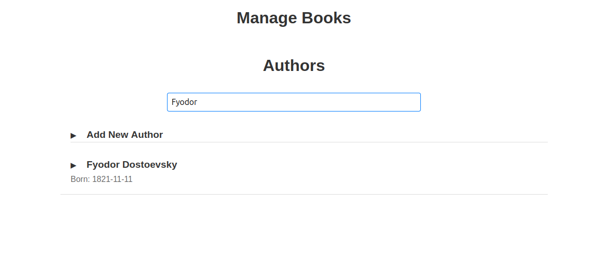
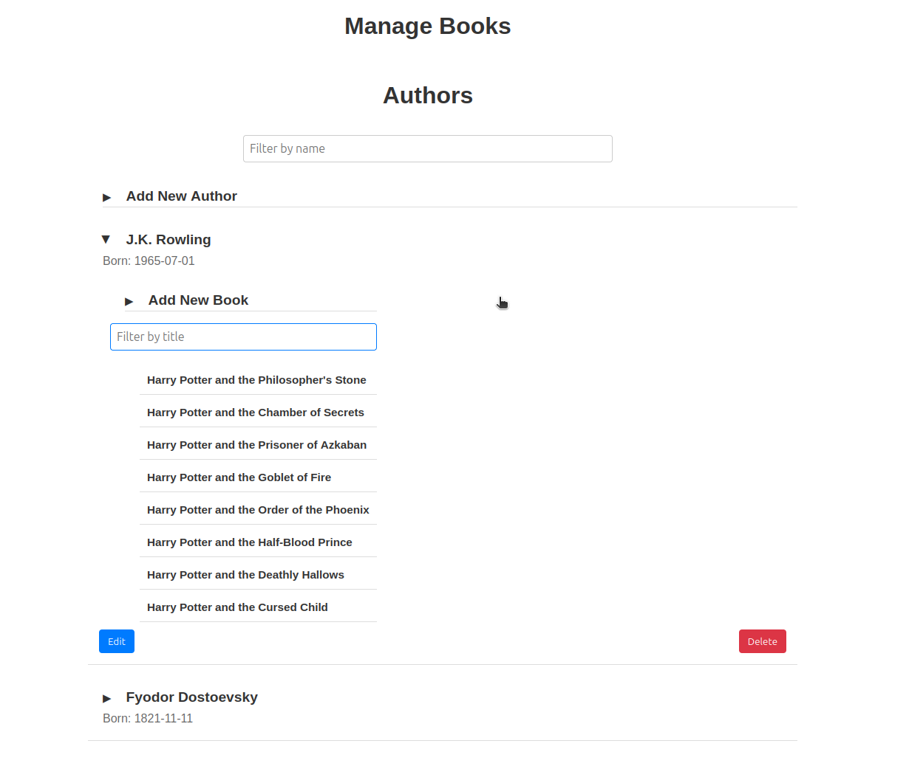
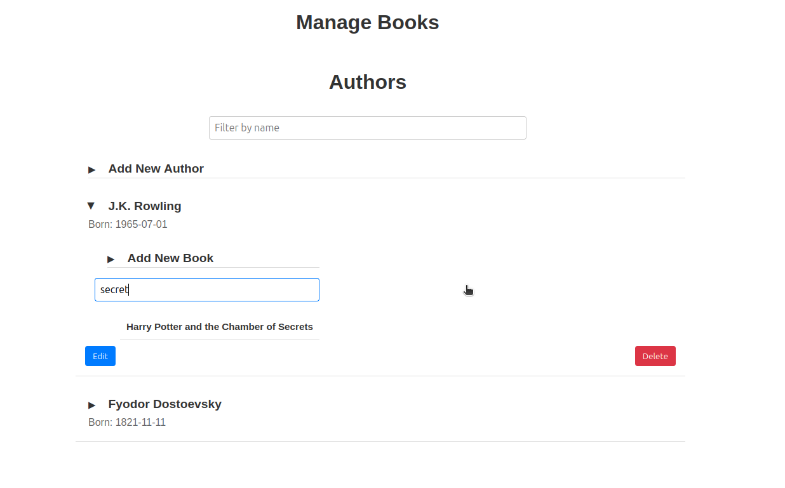
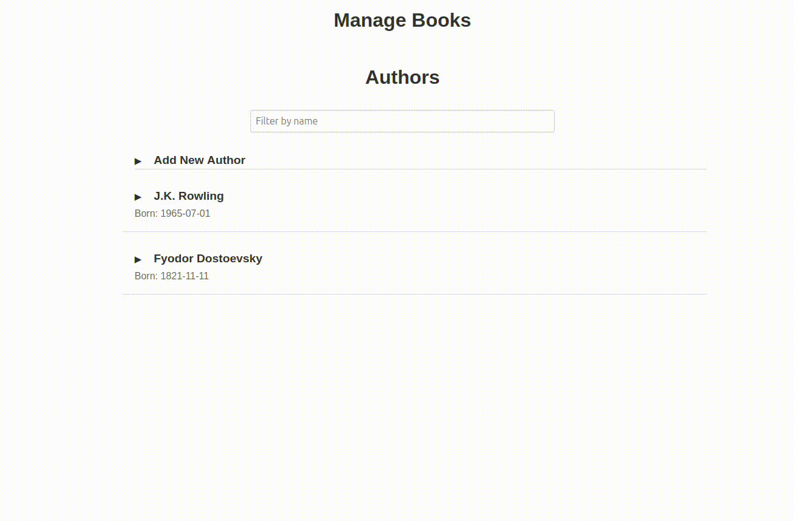
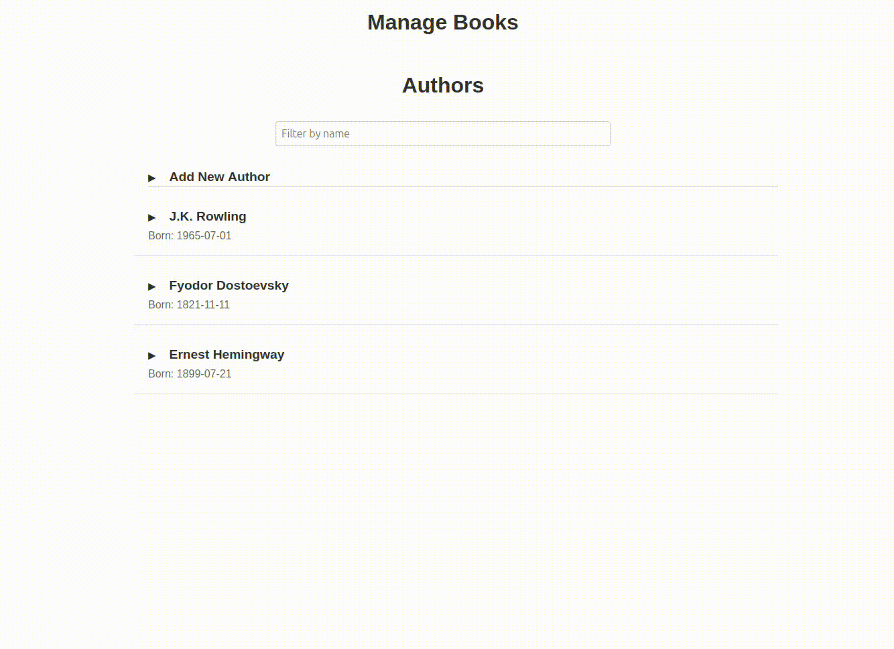
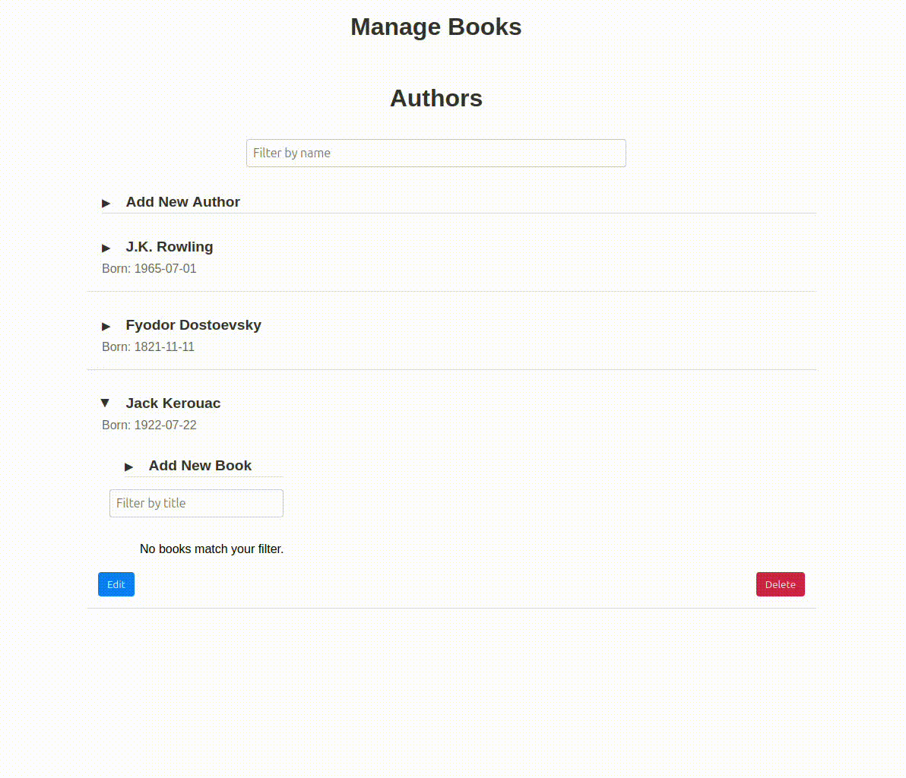
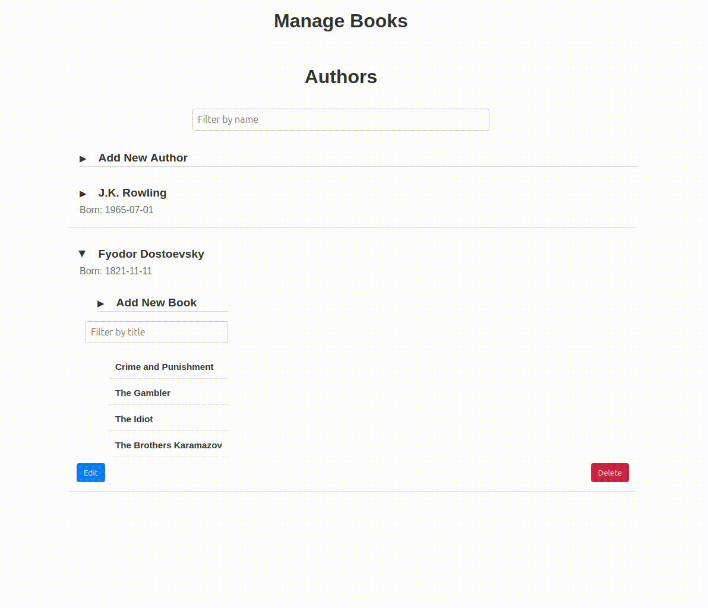
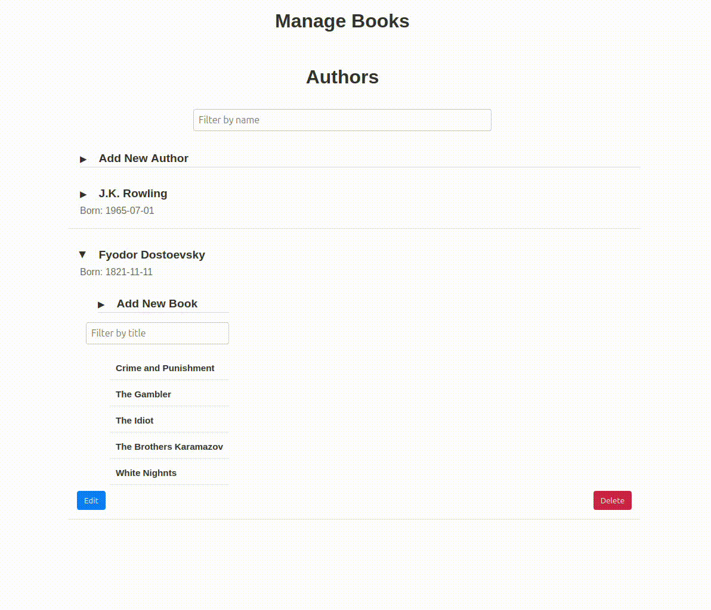

# Book Management Web Application

## Overview
This single-page web application, built with React, facilitates managing a list of books. It interacts with a REST API, providing functionalities to view, add, edit, and delete books. Users can also select authors from a list when adding or editing books.

## Features

### Main Page

### Filtering Authors

### View Books

### Filtering Books

### Adding Author

### Editing Author

### Deleting Author

### Adding Book

### Editing Book

### Deleting Book

